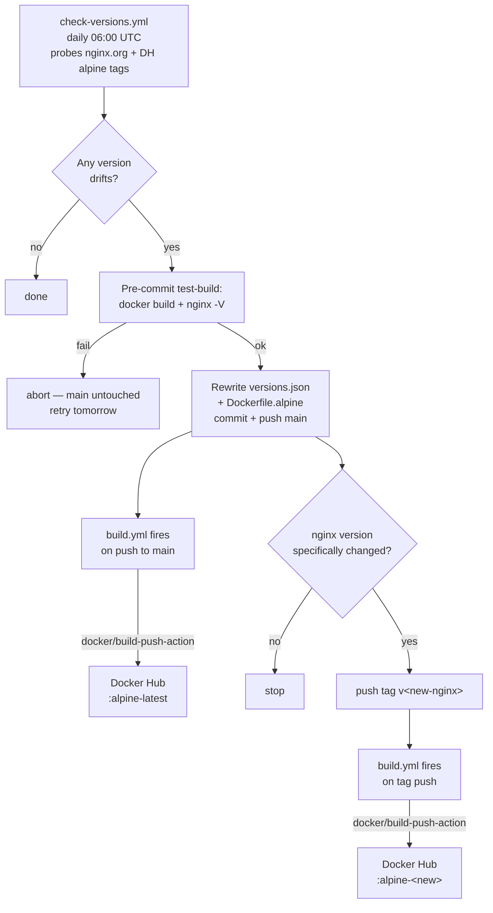

# Docker Hub setup for `armyguy255a/nginx`

> **2027-04-01:** Docker is retiring Automated Builds. This repo migrated to **GitHub Actions** per Docker's official migration guidance (<https://docs.docker.com/docker-hub/repos/manage/builds/migrate/>). All image builds now happen in `.github/workflows/build.yml`. There are no Docker Hub Build Rules to configure.

Produces 2 image tags:

| Tag | Trigger | Mutability |
|---|---|---|
| `armyguy255a/nginx:alpine-latest` | push to `main` (incl. `check-versions.yml` bumps) | rolling |
| `armyguy255a/nginx:alpine-<ver>` | git-tag push `v<ver>` | immutable snapshot |

## One-time setup

### 1. Create a Docker Hub Personal Access Token

1. Sign in to <https://hub.docker.com>.
2. Top-right avatar → **Account Settings** → **Personal Access Tokens** → **Generate new token**.
3. Description: `gh-actions-armyguy255a-nginx`.
4. **Access permissions: Read & Write**.
5. Copy the token (you only see it once).

### 2. Add the token + username as GitHub Actions secrets

In `ArmyGuy255A/nginx` → **Settings** → **Secrets and variables** → **Actions** → **New repository secret**:

| Secret name | Value |
|---|---|
| `DOCKERHUB_USERNAME` | `armyguy255a` |
| `DOCKERHUB_TOKEN` | the PAT from step 1 |

The same token can be reused for `ArmyGuy255A/nginx-appeid` (one token works across multiple repos under the same DH namespace). Add the same two secrets there too.

### 3. Delete the legacy Build configuration on Docker Hub

Once you've verified GitHub Actions is building + pushing successfully (after the first push to `main` post-merge):

1. Docker Hub → `armyguy255a/nginx` → **Builds** tab.
2. **Configure automated builds** → **Delete Build Configuration**.

After that there's nothing else to manage on Docker Hub for this repo — only `.github/workflows/build.yml` decides what gets pushed.

## How it flows

`:alpine-latest` rolls forward continuously. Versioned tags are immutable snapshots — consumers wanting auto-updates pin `:alpine-latest`; consumers wanting reproducibility pin a specific version like `:alpine-1.30.1`.

## Major-version transitions (Alpine 4, nginx 2)

Fully automated. Three safety gates protect against breakage:

1. **otel-apk presence**: the workflow only adopts an Alpine major.minor if `nginx-module-otel-*.apk` has been published for it at `nginx.org/packages/alpine/v<mm>/main/x86_64/`. Falls back through older minors until one has the apk.
2. **DH tag existence**: only Alpine versions that actually exist as DH tags are eligible.
3. **Pre-commit test-build**: after sed-ing the proposed versions in, `check-versions.yml` runs a real `docker build -f Dockerfile.alpine .` + `docker run --rm ... nginx -V`. If either fails, the workflow exits **before** the commit step. main and `:alpine-latest` stay on the last-known-good; tomorrow's run retries.

So Alpine 3 → 4 and nginx 1 → 2 are both hands-off transitions — the bumper either lands them cleanly or sits on the previous version while warning red in the Actions tab.

## Bare-minor fallback

If a new Alpine minor (e.g. `3.23`) is published but no `3.23.0` patch tag exists yet, the workflow pins the bare `3.23` tag. The next day's run picks up `3.23.1` as soon as it appears.

## GitHub Actions runner minutes budget

| Workflow | Cadence | Runner minutes / run |
|---|---|---|
| `validate.yml` | on PR / push | ~1 min |
| `check-versions.yml` (no drift) | daily | ~30s |
| `check-versions.yml` (drift; runs full test-build) | bump days only | ~5 min |
| `build.yml` | on every push to main + every `v*` tag | ~5 min (drops to ~1 min on cache hit) |

For a public repo, GH Actions is free. For private, this stays well under the free-tier 2000 min/month even with daily activity.

## Verifying after setup

1. Push a no-op commit to `main` (e.g. README typo fix) — `build.yml` should fire and push `:alpine-latest`.
2. Push the existing `v1.26.2` tag once to backfill the immutable variant: `git push origin refs/tags/v1.26.2`. `build.yml` should fire and push `:alpine-1.26.2`.
3. `docker pull armyguy255a/nginx:alpine-latest` → 200 OK.
4. Once both work, delete the DH Build configuration per step 3 of one-time setup.