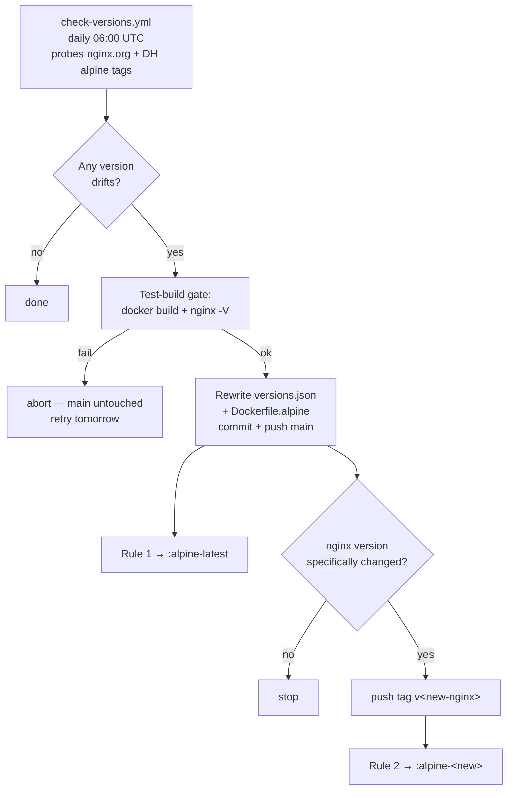

# Docker Hub setup for `armyguy255a/nginx`

One-time UI configuration in Docker Hub. Produces **2 image tags** (alpine-only — Ubuntu variant dropped for build-cost / pipeline simplicity):

```
armyguy255a/nginx:alpine-latest    ← rebuilds on every push to main
armyguy255a/nginx:alpine-<ver>     ← built on git-tag push v<ver>
```

> Docker Hub Automated Builds require a **Pro / Team / Business** plan.

## 1. Link GitHub source

Docker Hub → top-right avatar → **Account Settings** → **Linked accounts** → Connect GitHub. Authorize for `ArmyGuy255A/nginx`.

## 2. Create 2 Build Rules

Docker Hub → `armyguy255a/nginx` → **Builds** → **Configure Automated Builds**.

### Rule 1 — `alpine-latest` (rolling)

| Setting | Value |
|---|---|
| Source type | **Branch** |
| Source | `main` |
| **Docker tag** | **`alpine-latest`** |
| Dockerfile location | `Dockerfile.alpine` |
| Build context | `/` |
| Autobuild | ON |
| Build caching | ON |

### Rule 2 — `alpine-<version>` (immutable)

| Setting | Value |
|---|---|
| Source type | **Tag** |
| Source | `/^v(.+)$/` |
| **Docker tag** | **`alpine-{\1}`** |
| Dockerfile location | `Dockerfile.alpine` |
| Build context | `/` |
| Autobuild | ON |

## 3. (Optional) Description sync

Repo → **Settings** → **Description** → **Sync with source repository**.

## How it flows



`:alpine-latest` rolls forward continuously (every Alpine/openssl/zlib/nginx-patch bump). Versioned tags are **immutable snapshots** — consumers wanting auto-updates pin `:alpine-latest`, consumers wanting reproducibility pin a specific version like `:alpine-1.30.1`.

## Major-version transitions (Alpine 4, nginx 2)

Fully automated. Three safety gates protect against breakage:

1. **otel-apk presence**: the workflow only adopts an Alpine major.minor if `nginx-module-otel-*.apk` has been published for it at `nginx.org/packages/alpine/v<mm>/main/x86_64/`. Falls back through older minors until one has the apk.
2. **DH tag existence**: only Alpine versions that actually exist as DH tags are eligible.
3. **Test-build gate**: after sed-ing the proposed versions in, the workflow runs a real `docker build -f Dockerfile.alpine .` + `docker run --rm ... nginx -V`. If either fails (apk rename in Alpine 4, configure-flag drift in nginx 2, headers-more incompatibility, etc.), the workflow exits **before** the commit step. main stays on the last-known-good; tomorrow's run retries.

So Alpine 3 → 4 and nginx 1 → 2 are both hands-off transitions — the workflow either ships them cleanly or sits on the previous version while warning red in the Actions tab.

## Bare-minor fallback

If a new Alpine minor (e.g. `3.23`) is published but no `3.23.0` patch tag exists yet, the workflow pins the bare `3.23` tag. The next day's run picks up `3.23.1` as soon as it appears.

## Verifying after setup

1. Push a no-op commit to `main`. Rule 1 fires (~1 min).
2. Push the existing `v1.26.2` tag: `git push origin refs/tags/v1.26.2`. Rule 2 fires.
3. `docker pull armyguy255a/nginx:alpine-latest` → 200 OK.